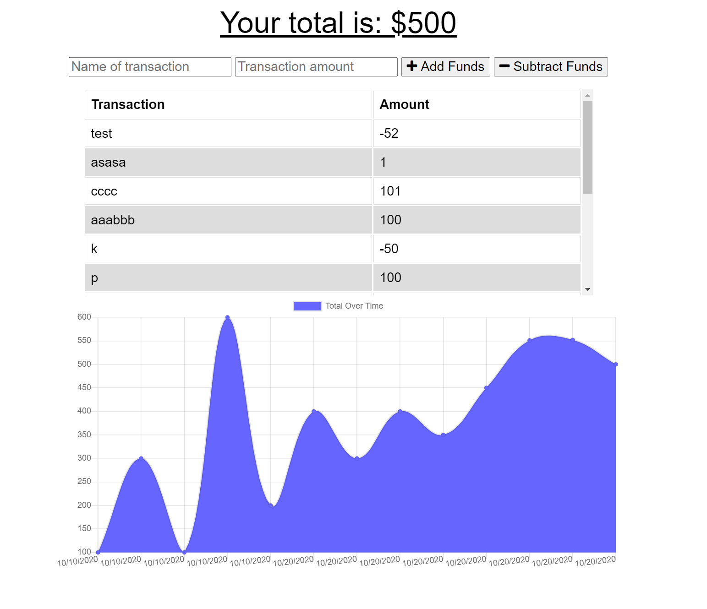

# Budget-tracker

"As an avid traveller I want to be able to track my withdrawals and deposits with or without a data/internet connection so that my account balance is accurate when I am traveling."

The user will be able to add expenses and deposits to their budget with or without a connection. When entering transactions offline, they should populate the total when brought back online.
Giving users a fast and easy way to track their money is important, but allowing them to access that information anytime is even more important.

**Author:** Melinda Ivanov

## Links
- https://github.com/jnsmelinda/Budget-tracker
- https://infinite-ravine-38710.herokuapp.com/

## Technologies
- [JavaScript](https://www.javascript.com)
- [Node.js](https://nodejs.org/en/)
- [HTML5](https://en.wikipedia.org/wiki/HTML5)
- [CSS3](https://en.wikipedia.org/wiki/Cascading_Style_Sheets)
- [Git](https://git-scm.com/), [GitHub](https://github.com)
- [MongoDB](https://www.mongodb.com/)
- [Heroku](https://www.heroku.com/)

## Installation
At first, you need to have [node.js](https://nodejs.org/) installed, then you need to install the required modules by running `npm install` in the command-line. If you haven't yet, you need to install MongoDB and start the application on your local machine.

## Demo

## Usage
Visit the heroku link and add your spending to our budget. View the trend  of your spending on the chart bellow.

## License
This repository is protected under the [MIT](https://choosealicense.com/licenses/mit/) license.

## Contribution
Please contribute to this project by opening a Pull Request and following the `eslint` rules and the [Code of Conduct](https://www.contributor-covenant.org/version/2/0/code_of_conduct/).

## Questions
You can contact me about issues and suggestions in [Email](mailto:jns.melinda@gmail.com), you can also find me on [Github](https://github.com/jnsmelinda).

## Others
Original desing is from the [University of Washington coding bootcamp](https://bootcamp.uw.edu).
 
© 2020 Melinda Ivanov
